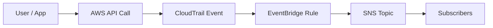

# AWS Study Notes: CloudTrail → EventBridge → SNS Alerts (API Call Interception)

## 1) Big idea
Many actions in AWS are **API calls** (console, CLI, SDK all call APIs). **AWS CloudTrail** records these API calls as events. **Amazon EventBridge** can receive those CloudTrail events and match them with **rules**. A rule can send matched events to a target such as **Amazon SNS** to notify you.

Typical use case: *“Alert me when someone does X.”*

## 2) End-to-end flow
1. A user/app performs an AWS API call (e.g., DynamoDB `DeleteTable`).
2. CloudTrail logs the API call.
3. EventBridge receives an event (commonly `detail-type: "AWS API Call via CloudTrail"`).
4. An EventBridge rule matches the event pattern (service + API name + optional filters).
5. EventBridge sends the event to a target (e.g., SNS topic).
6. SNS fan-outs notifications (email, SMS, HTTPS endpoint, Lambda, etc.).



## 3) What to match in EventBridge
Most CloudTrail-delivered events arrive with these useful fields:
- `source`: the AWS service event source in EventBridge (examples: `aws.dynamodb`, `aws.ec2`, `aws.sts`)
- `detail-type`: often `"AWS API Call via CloudTrail"`
- `detail.eventName`: the API action name (e.g., `DeleteTable`, `AssumeRole`, `AuthorizeSecurityGroupIngress`)
- `detail.userIdentity`: who performed the action
- `detail.requestParameters` and `detail.responseElements`: what was requested/returned (varies)

## 4) Example patterns (from the lecture)
### A) Alert when someone deletes a DynamoDB table
EventBridge pattern:

```json
{
  "source": ["aws.dynamodb"],
  "detail-type": ["AWS API Call via CloudTrail"],
  "detail": {
    "eventName": ["DeleteTable"]
  }
}
```

Common next step: add filters like a specific table name inside `detail.requestParameters.tableName` (when present) or restrict by IAM principal in `detail.userIdentity`.

### B) Alert when someone assumes a role
The API call is `AssumeRole` (recorded via CloudTrail). In EventBridge this is typically:

```json
{
  "source": ["aws.sts"],
  "detail-type": ["AWS API Call via CloudTrail"],
  "detail": {
    "eventName": ["AssumeRole"]
  }
}
```

### C) Alert on security group inbound rule changes
A common API call is `AuthorizeSecurityGroupIngress`:

```json
{
  "source": ["aws.ec2"],
  "detail-type": ["AWS API Call via CloudTrail"],
  "detail": {
    "eventName": ["AuthorizeSecurityGroupIngress"]
  }
}
```

## 5) Implementation checklist (practical)
- Ensure CloudTrail is enabled for management events (most accounts have it; confirm region coverage).
- In EventBridge, create a rule on the appropriate event bus (often the default bus).
- Use an event pattern that matches `source`, `detail-type`, and `detail.eventName`.
- Set the target to an SNS topic.
- Add SNS subscriptions (email is the fastest to validate).
- Test by performing the API action (in a sandbox) and verify you receive a notification.

## 6) Tips and gotchas
- **Region matters**: match where the API call occurs and where the rule is created.
- **Noise control**: start broad, then add filters (account, role, resource, specific parameters).
- **Security**: limit who can publish to the SNS topic; use topic policies.
- **Operational**: consider dead-letter queues / retry behavior for certain targets (depends on target type).

## 7) Quick self-check
1. Why can EventBridge “see” API calls? Where do they come from?
2. Which 3 fields are the simplest to match for a specific API call?
3. Give one alert use case involving IAM/STS and one involving EC2 networking.
