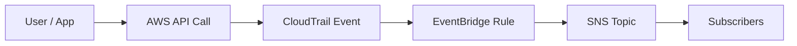

# Ghi chú học AWS: CloudTrail → EventBridge → SNS để cảnh báo (bắt API call)

## 1) Ý tưởng chính
Rất nhiều thao tác trong AWS thực chất là **API call** (Console, CLI, SDK đều gọi API). **AWS CloudTrail** ghi lại các API call này. **Amazon EventBridge** có thể nhận các sự kiện từ CloudTrail và dùng **rule** để “bắt” đúng loại sự kiện bạn quan tâm. Khi rule khớp, EventBridge có thể gửi sang **Amazon SNS** để thông báo.

Use case điển hình: *“Cảnh báo cho tôi khi ai đó làm X.”*

## 2) Luồng end-to-end
1. Người dùng/ứng dụng thực hiện một AWS API call (ví dụ DynamoDB `DeleteTable`).
2. CloudTrail ghi log API call đó.
3. EventBridge nhận được event (thường có `detail-type: "AWS API Call via CloudTrail"`).
4. Rule của EventBridge so khớp event theo pattern (service + tên API + bộ lọc).
5. EventBridge gửi event sang target (ví dụ SNS topic).
6. SNS phát thông báo tới subscriber (email, SMS, HTTPS endpoint, Lambda, …).



## 3) Nên match những trường nào trong EventBridge
Các event từ CloudTrail (đi vào EventBridge) thường có các trường hữu ích:
- `source`: dịch vụ AWS tương ứng trong EventBridge (ví dụ: `aws.dynamodb`, `aws.ec2`, `aws.sts`)
- `detail-type`: thường là `"AWS API Call via CloudTrail"`
- `detail.eventName`: tên API action (ví dụ `DeleteTable`, `AssumeRole`, `AuthorizeSecurityGroupIngress`)
- `detail.userIdentity`: ai thực hiện
- `detail.requestParameters` và `detail.responseElements`: tham số/response (tùy API)

## 4) Ví dụ pattern (đúng theo nội dung file.txt)
### A) Cảnh báo khi ai đó xóa bảng DynamoDB
EventBridge pattern:

```json
{
  "source": ["aws.dynamodb"],
  "detail-type": ["AWS API Call via CloudTrail"],
  "detail": {
    "eventName": ["DeleteTable"]
  }
}
```

Bạn có thể lọc thêm theo tên bảng trong `detail.requestParameters.tableName` (nếu có) hoặc lọc theo user/role trong `detail.userIdentity`.

### B) Cảnh báo khi ai đó assume role
API là `AssumeRole` (được CloudTrail ghi lại). Trong EventBridge thường là:

```json
{
  "source": ["aws.sts"],
  "detail-type": ["AWS API Call via CloudTrail"],
  "detail": {
    "eventName": ["AssumeRole"]
  }
}
```

### C) Cảnh báo khi thay đổi inbound rules của Security Group
Một API call phổ biến là `AuthorizeSecurityGroupIngress`:

```json
{
  "source": ["aws.ec2"],
  "detail-type": ["AWS API Call via CloudTrail"],
  "detail": {
    "eventName": ["AuthorizeSecurityGroupIngress"]
  }
}
```

## 5) Checklist triển khai (thực tế)
- Bật/kiểm tra CloudTrail (management events) và phạm vi region.
- Tạo EventBridge rule trên event bus phù hợp (thường là default bus).
- Dùng event pattern match `source`, `detail-type`, `detail.eventName`.
- Cấu hình target là SNS topic.
- Thêm SNS subscription (email dễ test nhất).
- Test bằng cách thực hiện API action (trong môi trường sandbox) và kiểm tra có nhận thông báo không.

## 6) Mẹo và lưu ý
- **Region**: rule nên ở đúng region nơi sự kiện phát sinh.
- **Giảm nhiễu**: bắt đầu rộng rồi thêm filter (account, role, resource, requestParameters).
- **Bảo mật**: dùng SNS topic policy để hạn chế publish/subscribe.
- **Vận hành**: cân nhắc retry/DLQ tùy loại target.

## 7) Tự kiểm tra
1. Vì sao EventBridge “nhìn thấy” được API call? Nguồn event là gì?
2. 3 trường đơn giản nhất để bắt đúng một API call cụ thể là gì?
3. Nêu một use case cảnh báo liên quan IAM/STS và một use case liên quan EC2 networking.
